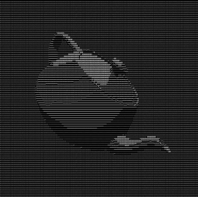

# max.js - Three.js integration for 3dsmax

 Comes with a nice postfx stack and it's very fun to play around with! Runs on WebGPU backend.



# Features

- **Realtime Sync** — Binary delta protocol over WebView2 shared memory.
- **ActiveShade** — Docks into a Max viewport for live feedback on your design
- **Layer Manager** — Early prototype / Outline for Playcanvas style script loading. (WIP)
- **Snapshots** — Fast export your scene to standalone (WIP)
- **Virtual Reality** — WebXR (only tested on Quest 3 VDXR) (WebGL only)

---

## Objects

- **Splat Origin** - Guassian Splat loading via Spark.js integration.
- **Audio Origin** - Load audio tracks

## Materials

Most 3dsmax materials are supported. Three.js materials can be created in material editor also. You might have to switch renderer to Three.js for it to show up.

### Supported Material Types

| 3ds Max Material | Three.js Output |
|---|---|
| **three.js Material** | MeshStandardMaterial / MeshPhysicalMaterial / MeshSSSNodeMaterial |
| **three.js Utility** | MeshDepthMaterial, MeshLambertMaterial, MeshMatcapMaterial, MeshNormalMaterial, MeshPhongMaterial, MeshBackdropNodeMaterial |
| **three.js TSL** | MeshTSLNodeMaterial (Custom shader code for materials (Parameterization supported)) | 
| **three.js Toon** | MeshToonMaterial |
| **Physical Material** | MeshStandardMaterial or MeshPhysicalMaterial (auto-promoted) |
| **glTF Material** | MeshStandardMaterial <br>1:1 mapping |
| **USD Preview Surface** | MeshStandardMaterial or MeshPhysicalMaterial |
| **VRay Material** | MeshPhysicalMaterial (refraction, coat, thin film mapped) |
| **OpenPBR Material** | MeshPhysicalMaterial (specular, coat, fuzz, transmission) |
| **MaterialX** | Load external MaterialX | 
| **Shell Material** | Reads viewport slot so you don't have to overwrite existing |

Auto-promotion to MeshPhysicalMaterial triggers when clearcoat, sheen, transmission, iridescence, anisotropy, or non-default IOR is detected. Map colors always drive result even if a bitmap is connected.
MaterialX Compiler slot can be used to convert 3dsMax OSL into MaterialX quickly (via MtlxIOUtil).

---

## Bitmaps

- **UberBitmap.osl** — Main bitmap node supported and translated by max.js
- **three.js TSL bitmap** — Custom shader code for materials (Parameterization supported)
- **three.js video textures** — Load .mp4 or .webm directly

---

## Lights

| Light Type | Shadows | Parameters |
|---|---|---|
| **Directional** | Yes | color, intensity, shadow bias/radius/mapsize |
| **Point** | Yes | color, intensity, distance, decay |
| **Spot** | Yes | color, intensity, distance, decay, angle, penumbra |
| **Rect Area** | No | color, intensity, width, height | 
| **Hemisphere** | No | color, intensity, ground color |
| **Ambient** | No | color, intensity |

All shadow-casting lights support configurable bias, blur radius, and map resolution.

---

## Post-Processing

Most effects require WebGPU backend. Supplied by three.js team with few of my own added (not in the list).

| Effect | Key Parameters |
|---|---|
| **SSGI** | radius, thickness, AO/GI intensity, slice count, step count, temporal jitter |
| **SSR** | quality, blur quality, max distance, opacity, thickness |
| **GTAO** | samples, distance exponent/falloff, radius, scale, thickness, resolution scale |
| **Motion Blur** | amount, sample count |
| **TRAA** | subpixel correction, depth threshold, edge depth diff, max velocity |
| **Bloom** | strength, radius, threshold |
| **Depth of Field** | focus distance, focal length, bokeh scale, auto-focus from camera |
| **Toon Outline** | thickness, alpha, color |
| **Contact Shadows** | max distance, thickness, intensity, quality, temporal |
| **Retro / CRT** | scanlines, curvature, vignette, color depth, dithering |
| **Pixel FX** | pixelation, chromatic aberration, sharpening, film grain, brightness, contrast, saturation |

### Node Properties

Per-node flags synced to Three.js: renderable, backface cull, cast shadows, receive shadows, camera visibility, reflection visibility, opacity.

---

## Animation

| Track Type | Data |
|---|---|
| **Transform** | position, rotation (quaternion), scale — per-frame matrix sampling |
| **Material** | color, roughness, metalness, opacity, clearcoat, sheen, transmission, IOR, attenuation, thickness, specular |
| **Geometry** | vertex animation baking (configurable 1-120 frame step) |
| **Camera** | position, target, FOV, DOF params, camera cuts via State Sets |
| **Visibility** | boolean visibility track |
| **Vertex Level Animation** | samples per frame |

---

## Environment

- **HDRIEnviron.osl** with exposure, gamma, and rotation controls
- **Sky** (three.js Sky): turbidity, rayleigh, mie coefficient/direction, sun elevation/azimuth, exposure
- **Fog (postfx):** linear (near/far), exponential (density), procedural noise (scale, speed, height falloff, animated turbulence)

---

## Snapshots (WIP)

One-click export to a self-contained HTML site with:
- Full scene hierarchy with transforms
- All PBR materials and texture assets
- Animation (transform, material, geometry, vertex level animation, camera cuts)
- Lights, environment (HDRI/sky), fog
- Gaussian splats
- Layers
- Automatic asset URL rewriting for portability

---

## Layer Manager (WIP)

Architecture:
- **Max-owned layers** — read-only mirror of the 3ds Max scene
- **JS-authored layers** — full ownership, hot-loaded from project folder, with access to 3dsmax objects + vibe coding potential.
- **Overlay layers** — UI/HUD elements outside the scene graph

Per-resource disposal tracking for materials, textures, and geometries. Layers persist per scene file.

# Exporting your scene standalone

- **Snapshot sites**: Click snapshot and it saves. That's it. Your mileage may vary when it comes to performance or missing stuff.
- This is work in progress. Do not actually try anything serious with this.

# Missing - To do

- Vertex Color processing
- Morpher under Skin (do not use morphers with skin modifier you will write vertex for every frame). Otherwise you can use it.

# Rendering frames

This tool targets web development but since it's registered as renderer I added some functions to get pictures out.

# Bugs
- ActiveShade can bug out if you maximize or minimize windows. Just use registered "kill maxjs" command in search menu
- No orthographic view (yet)
- Hair and Fur modifier causes mesh offset. 


# Build

**Requirements:** Visual Studio 2022 (v143 toolset), CMake 3.20+, 3ds Max 2026 SDK

```bash
# 1. Pull WebView2 SDK (one time)
setup_webview2.bat

# 2. Configure
cmake -B build -G "Visual Studio 17 2022" -A x64 .

# If your SDK isn't in the default path:
# cmake -B build -G "Visual Studio 17 2022" -A x64 -DMAXSDK_PATH="D:/your/sdk/maxsdk" .

# 3. Build
cmake --build build --config Release

# 4. Deploy (needs admin if Max is in Program Files)
copy build\Release\maxjs.gup "C:\Program Files\Autodesk\3ds Max 2026\plugins\"
```

Restart Max to load the plugin.

## License

MIT

clone - 2026
